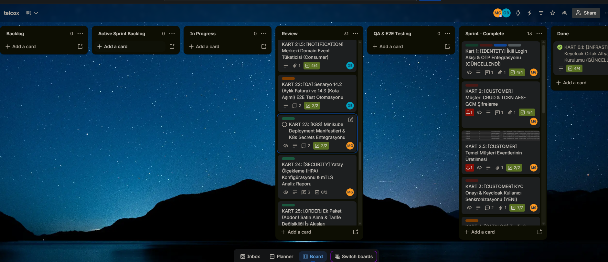
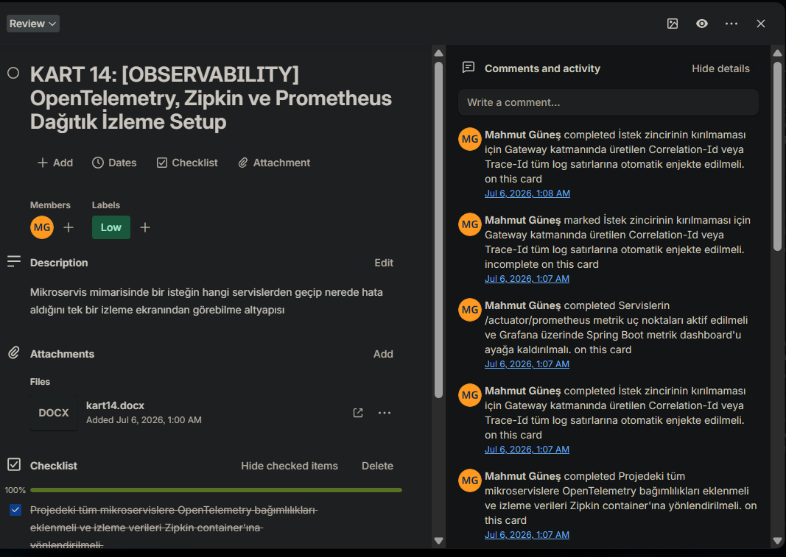
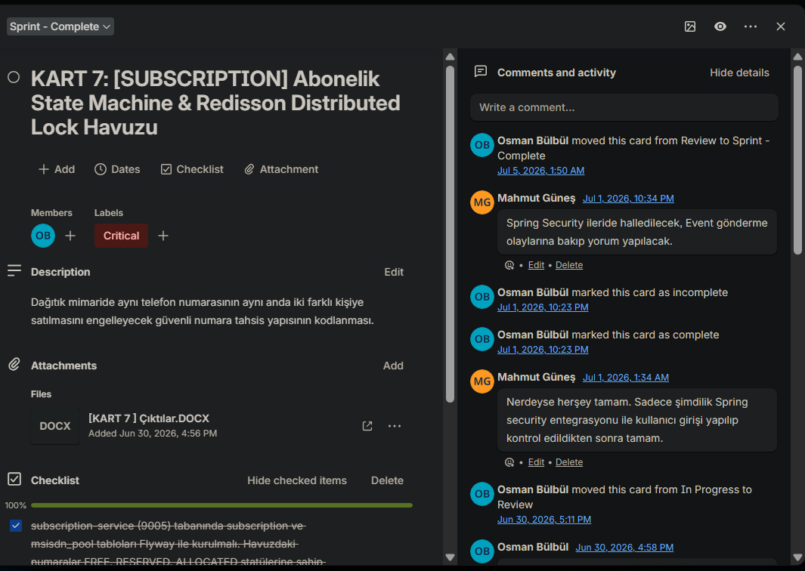

<p align="center">
  
  
  
  
  
  
  
  
  
</p>

# 📡 Telco CRM Platform

**Mikroservis Mimarisi ile Telekomünikasyon CRM Sistemi**

> Hayali operatörümüz **TelcoX**'in monolit CRM sistemini, ölçeklenebilir ve event-driven bir mikroservis ekosistemine dönüştüren uçtan uca bir platform. Müşteri kaydından faturalamaya, ödeme yönetiminden kota takibine kadar bir GSM operatörünün tüm abone yaşam döngüsünü yönetir.

---

## 📋 Trello Board — Proje Yönetimi


  Trello board ekran görüntülerinizi aşağıdaki alana ekleyin.
  Örnek kullanım:
  
  
  
  


<p align="center">
  <em>📸 Trello board ekran görüntüleri için resimleri <code>trello-screenshots/</code> klasörüne koyun ve yukarıdaki yorum satırlarını açın.</em>
</p>

| Sprint | Kart Aralığı | Odak Alanı |
|--------|-------------|------------|
| **Sprint 1** — Hafta 1 | KART 00 → KART 12 | Temel Servisler & Veri Katmanı |
| **Sprint 2** — Hafta 2 | KART 13 → KART 22 | İş Akışları & Entegrasyon |
| **Sprint 3** — Hafta 3 | KART 23 → KART 31 | Güçlendirme & MVP Teslim |

---

## 📑 İçindekiler

- [Proje Vizyonu](#-proje-vizyonu)
- [Mimari Genel Bakış](#-mimari-genel-bakış)
- [Proje Yapısı](#-proje-yapısı)
- [Servis Detayları](#-servis-detayları)
- [Ortak Modüller](#-ortak-modüller-shared-libraries)
- [Servisler Arası İletişim](#-servisler-arası-iletişim--event-akışı)
- [Saga Orkestrasyon](#-saga-orkestrasyon--yeni-hat-siparişi)
- [Teknoloji Yığını](#-teknoloji-yığını)
- [Gereksinimler](#-gereksinimler)
- [Kurulum & Çalıştırma](#-kurulum--çalıştırma)
- [Docker Compose Profilleri](#-docker-compose-profilleri)
- [Kubernetes Deployment](#-kubernetes-deployment)
- [Observability Stack](#-observability-stack)
- [Güvenlik Mimarisi](#-güvenlik-mimarisi)
- [Test Stratejisi](#-test-stratejisi)
- [Servis Portları](#-servis-portları)
- [Ortam Değişkenleri](#-ortam-değişkenleri)
- [Geliştirici Araçları](#-geliştirici-araçları)
- [ER Diyagramları](#-er-diyagramları)
- [Kabul Senaryoları](#-kabul-senaryoları-mvp)
- [Ekip](#-ekip)

---

## 🎯 Proje Vizyonu

Telco CRM Platform, bir GSM operatörünün abonelerine yönelik tüm yaşam döngüsü süreçlerini — müşteri kaydı, ürün siparişi, faturalandırma, kullanım takibi, müşteri destek — tek bir mikroservis ekosistemi üzerinden yönetebilen, **ölçeklenebilir** ve **event-driven** bir CRM platformudur.

### Eğitim Hedefleri

Bu proje ile kazanılan yetkinlikler:

- ✅ **Domain-Driven Design** — Bounded context çıkarımı ve aggregate tasarımı
- ✅ **Spring Boot 4 + Spring Cloud** — Production-grade mikroservis geliştirme
- ✅ **Apache Kafka + Debezium CDC** — Event-driven, transactional outbox pattern
- ✅ **Saga Orchestration** — Dağıtık transaction yönetimi ve kompansasyon
- ✅ **PostgreSQL (Database-per-Service)** — İzole veri katmanları
- ✅ **Redis** — Cache-aside, rate limiting, idempotency keys, distributed lock
- ✅ **Keycloak + OAuth2** — Kimlik doğrulama ve yetkilendirme
- ✅ **Docker Compose + Kubernetes** — Lokal orkestrasyon ve production deployment
- ✅ **OpenTelemetry + Zipkin + Prometheus + Grafana** — Observability stack
- ✅ **Resilience4j** — Circuit breaker, retry, bulkhead pattern
- ✅ **MinIO** — S3-uyumlu nesne depolama (fatura PDF)

---

## 🏗 Mimari Genel Bakış

```
                         ┌──────────────────────┐
                         │  Web / Mobile Client  │
                         └──────────┬───────────┘
                                    │
                         ┌──────────▼───────────┐
                         │     API Gateway       │ ← JWT Validation, Rate Limit
                         │      (8080)           │   Keycloak JWKS, Auth Relay
                         └──────────┬───────────┘
                                    │
              ┌─────────────────────┼─────────────────────┐
              │                     │                     │
    ┌─────────▼──────┐   ┌─────────▼──────┐   ┌─────────▼──────┐
    │ Discovery Srv  │   │  Config Server │   │    Keycloak     │
    │  Eureka (8761) │   │    (8888)      │   │    (9011)       │
    └────────────────┘   └────────────────┘   └────────────────┘
              │
    ┌─────────┼──────────────────────────────────────────────┐
    │         │         │         │         │         │       │
    ▼         ▼         ▼         ▼         ▼         ▼       ▼
┌────────┐┌────────┐┌────────┐┌────────┐┌────────┐┌────────┐┌────────┐
│Identity││Customer││Catalog ││ Order  ││Subscr. ││ Usage  ││  CDR   │
│ (9001) ││ (9002) ││ (9003) ││ (9004) ││ (9005) ││ (9006) ││Simulat.│
└───┬────┘└───┬────┘└───┬────┘└───┬────┘└───┬────┘└───┬────┘└───┬────┘
    │         │         │         │         │         │         │
    └─────────┴─────────┴────┬────┴─────────┴─────────┴─────────┘
                             │
                   ┌─────────▼──────────┐
                   │   Apache Kafka     │  ← Debezium CDC + Outbox
                   │   (KRaft Mode)     │
                   └─────────┬──────────┘
                             │
    ┌────────────────────────┼────────────────────────┐
    │              │              │              │     │
    ▼              ▼              ▼              ▼     ▼
┌────────┐  ┌────────┐  ┌────────────┐  ┌────────┐┌────────┐
│Billing │  │Payment │  │Notification│  │ Ticket ││Analytics│
│ (9007) │  │ (9008) │  │  (9009)    │  │ (9010) ││(future) │
└────────┘  └────────┘  └────────────┘  └────────┘└────────┘
```

---

## 📂 Proje Yapısı

```
telco-crm-microservices/
├── pom.xml                         ← Root POM (tüm versiyon yönetimi)
├── docker-compose.yml              ← Altyapı + DB + Uygulama + Araçlar
├── Dockerfile                      ← Paylaşılan multi-stage build
├── .env.example                    ← Ortam değişkenleri şablonu
├── start-platform.ps1              ← Sıralı platform başlatma scripti
├── stop-platform.ps1               ← Platform durdurma scripti
│
├── config-repo/                    ← Merkezi konfigürasyon (git-backed)
│   └── configs/                    ← Servis bazlı profil dosyaları
│       ├── application.yml         ← Ortak ayarlar
│       ├── application-dev.yml     ← Dev profil
│       ├── application-k8s.yml     ← K8s profil
│       ├── customer-service/       ← Her servisin kendi config'i
│       ├── billing-service/
│       └── ...
│
├── common-core/                    ← Paylaşılan kontratlar (event, exception, model)
├── common-web/                     ← Servlet paylaşılan katman (filter, handler)
├── common-persistence/             ← JPA paylaşılan katman (BaseEntity, Outbox)
│
├── discovery-server/               ← Eureka Service Registry        :8761
├── config-server/                  ← Spring Cloud Config Server     :8888
├── api-gateway/                    ← Edge Routing + JWT + Rate Limit :8080
│
├── identity-service/               ← Keycloak Proxy, OTP Login      :9001
├── customer-service/               ← Müşteri CRUD, KYC, PII Şifreleme :9002
├── product-catalog-service/        ← Tarife, Addon, Redis Cache     :9003
├── order-service/                  ← Sipariş, Saga Orkestrasyon     :9004
├── subscription-service/           ← Abonelik State Machine, MSISDN :9005
├── usage-service/                  ← CDR Consumer, Kota Takibi      :9006
├── billing-service/                ← Bill-run, PDF, Overage         :9007
├── payment-service/                ← Ödeme, Idempotency, Wallet     :9008
├── notification-service/           ← SMS/Email, Mailpit             :9009
├── ticket-service/                 ← Destek Talebi, SLA             :9010
├── cdr-simulator/                  ← CDR Simülatör (yük testi)
│
├── debezium/                       ← CDC Connector konfigürasyonları
│   └── connectors/                 ← Her servis için outbox connector JSON
│
├── docker/                         ← Docker ek konfigürasyonlar
│   ├── grafana/                    ← Grafana dashboard'ları
│   ├── keycloak/                   ← Realm import dosyaları
│   └── prometheus/                 ← Prometheus scrape config
│
├── k8s/                            ← Kubernetes manifest dosyaları
│   ├── namespace.yaml
│   ├── api-gateway/
│   ├── billing-service/
│   └── ... (tüm servisler)
│
├── k6-tests/                       ← Performans test scriptleri
│   ├── bill_run_performance_test.js
│   └── performance_report.txt
│
├── er-diagrams/                    ← ER diyagramları (Draw.io PNG)
│   ├── telco-crm-er.drawio.png    ← Tüm sistem ER diyagramı
│   └── *-service-er.drawio.png    ← Servis bazlı ER diyagramları
│
├── mermaid-images/                 ← UML diyagramları
│   ├── usecasesDiyagrami ...       ← Use Case diyagramı
│   ├── sinifDiyagrami ...          ← Sınıf diyagramı
│   └── sequencesDiyagram ...       ← Sequence diyagramı
│
└── test_e2e_*.py                   ← E2E test scriptleri (Python)
```

---

## 🔧 Servis Detayları

### 🏢 Identity Service (Port: 9001)

**Sorumluluk:** Keycloak proxy, ikili login akışı (Admin/Dealer: şifre, Müşteri: OTP).

| API | Açıklama |
|-----|----------|
| `POST /api/v1/auth/login` | Admin/Dealer şifre ile giriş (Keycloak Direct Access Grant) |
| `POST /api/v1/auth/otp/request` | Müşteri OTP kodu talep etme |
| `POST /api/v1/auth/otp/verify` | OTP doğrulama ve JWT üretimi |

**Önemli:** Özel JWT üretme/Redis blacklist yerine Keycloak entegrasyonu kullanılır.

---

### 👤 Customer Service (Port: 9002)

**Sorumluluk:** Müşteri yaşam döngüsü yönetimi, KYC onayı, Keycloak kullanıcı senkronizasyonu.

| API | Açıklama |
|-----|----------|
| `POST /api/v1/customers` | Yeni müşteri kaydı (Dealer tarafından) |
| `GET /api/v1/customers/{id}` | Müşteri detayı |
| `PUT /api/v1/customers/{id}` | Müşteri güncelleme |
| `DELETE /api/v1/customers/{id}` | Soft-delete (KVKK) |
| `POST /api/v1/customers/{id}/kyc/approve` | KYC onayı + Keycloak user oluşturma |

**Eventler:** `CustomerRegistered`, `CustomerKYCApproved`, `CustomerUpdated`

**Teknik Detay:** TCKN alanı `AES-GCM` ile şifrelenir (`PiiEncryptionConverter`). KYC onayında atomik olarak hem Keycloak user oluşturulur hem DB güncellenir.

---

### 📦 Product Catalog Service (Port: 9003)

**Sorumluluk:** Tarife, addon ve VAS ürünlerinin master kataloğu. Read-heavy — Redis cache yoğun.

| API | Açıklama |
|-----|----------|
| `GET /api/v1/tariffs` | Tüm tarifeler (Redis cached, TTL: 10dk) |
| `GET /api/v1/tariffs/{code}` | Tekil tarife (Redis cached, TTL: 30dk) |
| `POST /api/v1/tariffs` | Yeni tarife oluşturma (Admin) |
| `GET /api/v1/addons` | Ek paketler |

**Eventler:** `TariffCreated`, `TariffPriceChanged`

**Teknik Detay:** Tarife güncellemelerinde **immutable versioning** — eski kayıt ezilmez, yeni versiyon satırı oluşturulur. Cache eviction otomatik tetiklenir.

---

### 🛒 Order Service (Port: 9004)

**Sorumluluk:** Sipariş alma ve Saga orchestration. Customer → Catalog → Payment → Subscription zincirini yönetir.

| API | Açıklama |
|-----|----------|
| `POST /api/v1/orders` | Yeni sipariş oluşturma |
| `GET /api/v1/orders/{id}` | Sipariş detayı |
| `POST /api/v1/orders/{id}/cancel` | Sipariş iptali |
| `POST /api/v1/orders/addons` | Ek paket siparişi |

**Durum Geçişleri:** `DRAFT` → `PENDING_PAYMENT` → `PAID` → `FULFILLED` / `CANCELLED`

**Eventler:** `OrderCreated`, `OrderConfirmed`, `OrderCancelled`

**Resilience4j:** OpenFeign çağrılarında circuit breaker (hata oranı %50 → devre açık), 3 denemeli exponential backoff retry.

---

### 📱 Subscription Service (Port: 9005)

**Sorumluluk:** Abonelik state machine, MSISDN havuzu ve numara tahsisi.

| API | Açıklama |
|-----|----------|
| `POST /api/v1/subscriptions` | Abonelik oluşturma (Order tarafından) |
| `GET /api/v1/subscriptions/{id}` | Abonelik detayı |
| `POST /api/v1/subscriptions/{id}/suspend` | Askıya alma |
| `POST /api/v1/subscriptions/{id}/reactivate` | Yeniden aktivasyon |
| `POST /api/v1/subscriptions/{id}/terminate` | Sonlandırma |

**MSISDN Havuzu:** `FREE` → `RESERVED` → `ALLOCATED` | **Redisson Distributed Lock** ile çakışma koruması (Lock Key: `lock:msisdn:{number}`, Timeout: 5sn)

**Eventler:** `SubscriptionActivated`, `SubscriptionSuspended`, `SubscriptionTerminated`, `MSISDNAllocated`

---

### 📊 Usage Service (Port: 9006)

**Sorumluluk:** CDR event tüketimi, kullanım sayaçları ve kota yönetimi. Write-heavy servis.

| API | Açıklama |
|-----|----------|
| `GET /api/v1/usage/subscriptions/{id}/quota` | Anlık kalan kota |
| `GET /api/v1/usage/subscriptions/{id}/history` | Kullanım geçmişi |

**Kafka Consumer:** `CdrRecorded` eventlerini `MSISDN` partition key ile tüketir — aynı abonenin harcamaları sıralı işlenir.

**Eşik Eventleri:** %80 kullanımda `QuotaThresholdReached`, %100'de `QuotaExceeded` eventi üretilir.

---

### 💰 Billing Service (Port: 9007)

**Sorumluluk:** Aylık bill-run, fatura üretimi, PDF oluşturma ve MinIO depolama.

| API | Açıklama |
|-----|----------|
| `GET /api/v1/invoices?customerId=...` | Müşteri faturaları |
| `GET /api/v1/invoices/{id}` | Fatura detayı |
| `GET /api/v1/invoices/{id}/pdf` | MinIO presigned URL (10dk geçerli) |
| `POST /api/v1/billing/runs` | Manuel bill-run tetikleme (Admin) |

**Cron Job'lar:**
- Aylık bill-run: `Redisson RLock` ile `bill-run:{yyyyMM}` dağıtık kilidi
- Günlük overdue kontrolü: `dueDate` geçen faturaları `OVERDUE` yapar

**Fatura Kalemleri:** Aylık ücret + addon + aşım (overage) + VAS + vergiler

**Eventler:** `InvoiceGenerated`, `InvoicePaid`, `InvoiceOverdue`

**PDF:** iText ile üretilir, MinIO `telcox-invoices` bucket'ına yüklenir.

---

### 💳 Payment Service (Port: 9008)

**Sorumluluk:** Ödeme alma, idempotency garantisi, wallet sistemi ve mock PSP entegrasyonu.

| API | Açıklama |
|-----|----------|
| `POST /api/v1/payments` | Ödeme (Idempotency-Key zorunlu) |
| `GET /api/v1/payments/{id}` | Ödeme detayı |
| `POST /api/v1/payments/{id}/refund` | İade |
| `POST /api/v1/payments/wallet/top-up` | Cüzdan yükleme |

**Idempotency:** `Idempotency-Key` header zorunlu → Redis `SET NX` (24 saat TTL). Duplicate istekte ilk işlemin sonucu döner.

**Akıllı Retry:** Başarısız ödemelerde 24 → 72 → 168 saat aralıkla otomatik tekrar deneme.

**Wallet:** Fatura ödemesinde önce cüzdan bakiyesi kontrol edilir, yetmezse kalan tutar PSP'ye yönlendirilir.

**Eventler:** `PaymentCompleted`, `PaymentFailed`, `PaymentRefunded`

---

### 📧 Notification Service (Port: 9009)

**Sorumluluk:** Çok kanallı bildirim (SMS, E-posta), şablon yönetimi ve Mailpit entegrasyonu.

| API | Açıklama |
|-----|----------|
| `POST /api/v1/notifications` | Bildirim gönderme (internal) |
| `GET /api/v1/notifications/users/{id}/history` | Bildirim geçmişi |

**Tükettiği Eventler:**

| Event | Aksiyon |
|-------|---------|
| `SubscriptionActivated` | Hoş geldiniz SMS'i |
| `InvoiceGenerated` | Fatura e-postası (PDF URL ile) |
| `QuotaThresholdReached` | %80 kota uyarı SMS'i |
| `QuotaExceeded` | Kota aşım bildirimi |
| `InvoiceOverdue` | Gecikmiş fatura uyarısı |

**Mailpit:** Dev ortamında gerçek mail gönderilmez; Mailpit mock SMTP sunucusuna yönlendirilir.

---

### 🎫 Ticket Service (Port: 9010)

**Sorumluluk:** Müşteri destek talepleri, SLA yönetimi ve otomatik zaman aşımı kontrolü.

| API | Açıklama |
|-----|----------|
| `POST /api/v1/tickets` | Destek talebi oluşturma |
| `GET /api/v1/tickets/{id}` | Talep detayı |
| `POST /api/v1/tickets/{id}/comments` | Yorum ekleme |
| `POST /api/v1/tickets/{id}/assign` | Atama |
| `POST /api/v1/tickets/{id}/resolve` | Çözüm |

**SLA:** Önceliğe göre (`CRITICAL`, `HIGH`, `MEDIUM`) otomatik `slaDueAt` hesaplama. Cron job ile SLA ihlali tespiti → `SlaBreached` eventi.

---

### 🔄 CDR Simulator

**Sorumluluk:** Gerçekçi şebeke yükü simülasyonu. Saniyede 100 `CdrRecorded` eventi üretir.

- Kafka `telco.usage.events` topic'ine MSISDN partition key ile basım
- Hız ve hedef MSISDN listesi `application.yml`'den konfigüre edilebilir

---

## 📚 Ortak Modüller (Shared Libraries)

### `common-core`

Tüm servislerin kullandığı en temel paylaşılan kontratlar. Spring MVC/JPA bağımlılığı yoktur — reaktif `api-gateway` dahil tüm modüller tüketebilir.

| Bileşen | Açıklama |
|---------|----------|
| `EventConstants` | Kafka topic isimleri sabit tanımları |
| `HeaderConstants` | `X-User-Id`, `X-Correlation-Id` header sabitleri |
| `BaseDomainEventEnvelope` | Standart Kafka event zarfı |
| `UserContext` | Gateway'den gelen kullanıcı bilgileri |
| `BaseBusinessException` | Hata hiyerarşisi kök sınıfı |
| `ProblemDetails` | RFC 7807 hata yanıt modeli |
| `MoneyValueObject` | Para birimi + tutar value object |
| `PageResponse<T>` | Sayfalı liste standart modeli |

### `common-web`

Servlet tabanlı servisler için HTTP katman altyapısı.

| Bileşen | Açıklama |
|---------|----------|
| `GlobalExceptionHandler` | RFC 7807 formatlı hata yanıtları |
| `CorrelationIdFilter` | Correlation ID MDC enjeksiyonu |
| `UserContextResolver` + `@CurrentUser` | Gateway header'larından user context parse |
| `PageableResponseHelper` | `Page<T>` → `PageResponse<T>` dönüşümü |

> ⚠️ `api-gateway`'e **eklenmez** — gateway reaktif stack (WebFlux) kullanır.

### `common-persistence`

JPA kullanan servisler için veri katmanı temeli.

| Bileşen | Açıklama |
|---------|----------|
| `BaseEntity` | `id`, `createdAt`, `updatedAt`, `createdBy`, `updatedBy` otomatik yönetim |
| `OutboxEvent` + `OutboxPublisher` | Transactional Outbox pattern |
| `IdempotentConsumer` + `ProcessedEvent` | Duplicate event koruması |
| `PiiEncryptionConverter` | TCKN/Kart no AES-GCM şifreleme |
| SQL Şablonları | `outbox_event.sql`, `processed_event.sql` migration şablonları |

---

## 🔀 Servisler Arası İletişim & Event Akışı

### Senkron vs Asenkron Karar Tablosu

| Senaryo | İletişim | Gerekçe |
|---------|----------|---------|
| Order → Customer kontrolü | REST (senkron) | İmmediat doğrulama gerekli |
| Order → Catalog fiyat alma | REST + cache | Snapshot alınmalı |
| Order → Subscription aktivasyonu | Kafka (asenkron) | Eventual consistency |
| CDR → Usage kota düşme | Kafka (asenkron) | Yüksek hacim |
| Invoice → Notification | Kafka (asenkron) | Loose coupling |
| Payment → PSP doğrulama | REST (senkron) | Anlık geri dönüş gerekli |

### Kafka Topic Konvansiyonu

Debezium Outbox EventRouter kullanılır. Her servis kendi aggregate'i için **tek bir topic**'e yazar:

```
telcox.<AggregateType>.events
```

| Topic | Servis | Event Tipleri |
|-------|--------|---------------|
| `telcox.Customer.events` | customer-service | CustomerRegistered, CustomerKYCApproved, CustomerUpdated |
| `telcox.Order.events` | order-service | OrderCreated, OrderConfirmed, OrderCancelled |
| `telcox.Payment.events` | payment-service | PaymentCompleted, PaymentFailed, PaymentRefunded |
| `telcox.Subscription.events` | subscription-service | SubscriptionActivated, SubscriptionSuspended, MSISDNAllocated |
| `telcox.Billing.events` | billing-service | InvoiceGenerated, InvoicePaid, InvoiceOverdue |
| `telcox.Usage.events` | usage-service | QuotaThresholdReached, QuotaExceeded |
| `telcox.Ticket.events` | ticket-service | TicketOpened, TicketResolved, SlaBreached |
| `telco.usage.events` | cdr-simulator | CdrRecorded |

> Event tipi, mesajın `eventType` alanından ayırt edilir — her event için ayrı topic **açılmaz**.

---

## 🔄 Saga Orkestrasyon — Yeni Hat Siparişi

```
Müşteri ─── POST /orders ──▶ Order Service
                                  │
                            ① OrderCreated ═══▶ Kafka
                                                  │
                            Payment Service ◀─────┘
                                  │
                           Charge attempt (Mock PSP)
                                  │
                            ② PaymentCompleted ═══▶ Kafka
                                                      │
                            Order Service ◀────────────┘
                                  │
                           sipariş → PAID
                            ③ OrderConfirmed ═══▶ Kafka
                                                    │
                            Subscription Service ◀──┘
                                  │
                           MSISDN tahsis (Redisson Lock)
                           Abonelik → ACTIVE
                                  │
                            ④ SubscriptionActivated ═══▶ Kafka
                                                          │
                ┌─────────────────────────────────────────┘
                │                                   │
        Order Service                    Notification Service
        sipariş → FULFILLED              "Hoş Geldiniz" SMS
```

### Kompansasyon (Geri Alma)

```
SubscriptionActivationFailed ──▶ SagaOrchestrator (COMPENSATING)
         │
    PaymentRefundRequested ──▶ Payment Service (iade)
         │
    PaymentRefunded ──▶ Order Service (CANCELLED) + Saga (COMPENSATED)
```

---

## 🛠 Teknoloji Yığını

| Katman | Teknoloji | Sürüm / Not |
|--------|-----------|-------------|
| **Dil** | Java | 21 (LTS) |
| **Framework** | Spring Boot | 4.0.6 |
| **Cloud** | Spring Cloud (Gateway, Config, Eureka, OpenFeign) | 2025.1.1 |
| **Build** | Maven Multi-Module | Wrapper 3.9 gömülü |
| **DB** | PostgreSQL | 17, database-per-service |
| **Cache** | Redis | 7 |
| **Broker** | Apache Kafka | KRaft mode (Zookeeper yok) |
| **CDC** | Debezium | PostgreSQL Connector + Outbox EventRouter |
| **Migration** | Flyway | Her serviste |
| **ORM** | Spring Data JPA + Hibernate | — |
| **Mapping** | MapStruct | 1.6.3 |
| **Validation** | Jakarta Bean Validation | — |
| **Auth** | Keycloak + Spring Security OAuth2 | 24.0.5 |
| **API Doc** | Springdoc OpenAPI | 3.0.3 (Gateway Swagger Agregasyonu) |
| **Resilience** | Resilience4j | Circuit breaker, retry, bulkhead |
| **Observability** | Micrometer + OpenTelemetry + Zipkin | — |
| **Metrikler** | Prometheus + Grafana | — |
| **Logging** | Logstash Logback Encoder | JSON structured log |
| **Lock** | Redisson | Distributed lock (MSISDN, Bill-run) |
| **Object Store** | MinIO | Fatura PDF depolama |
| **Email** | Mailpit | Dev ortamı mock SMTP |
| **PDF** | iText 7 | Fatura PDF üretimi |
| **Container** | Docker + Docker Compose | Multi-stage build |
| **Orchestration** | Kubernetes (Minikube) | HPA, Secrets |
| **Test** | JUnit 5, Mockito, RestAssured, k6 | — |
| **CI/CD** | GitHub Actions | — |

---

## 📋 Gereksinimler

| Araç | Minimum Versiyon |
|------|-----------------|
| Java | **21** |
| Maven | **3.9+** (repo'da Maven Wrapper `./mvnw` gömülü) |
| Docker | **24+** |
| Docker Compose | **2.x** (`docker compose` komutu) |

---

## 🚀 Kurulum & Çalıştırma

### 1. Repository'yi Klonla

```bash
git clone https://github.com/Mhmt2534/telco-crm.git
cd telco-crm/telco-crm-microservices
```

### 2. Ortam Değişkenlerini Ayarla

```bash
cp .env.example .env
# .env dosyasını ihtiyacına göre düzenle
```

### 3. Docker İmajlarını Hazırla (İlk Kurulum)

```bash
docker pull maven:3.9-eclipse-temurin-21
docker pull eclipse-temurin:21-jre
```

### 4. Altyapıyı Başlat

```bash
# Sadece altyapı (Kafka, Redis, Zipkin, Keycloak, MinIO)
docker compose up -d

# Sağlık kontrolü
docker compose ps
```

> Tüm servisler `healthy` olana kadar bekle (~30-60 saniye).

### 5. Projeyi Derle

```bash
# Linux / macOS
./mvnw clean install -DskipTests

# Windows (PowerShell)
.\mvnw.cmd clean install -DskipTests
```

### 6. Servisleri Başlat

**Seçenek A — PowerShell Script (Önerilen)**

```powershell
.\start-platform.ps1
# Sıralı başlatma: Infrastructure → Discovery → Config → Business Services → Gateway
# Her servisin /actuator/health UP olmasını bekler
```

**Seçenek B — Manuel Başlatma**

```bash
# Önce altyapı servisleri
java -jar config-server/target/config-server-1.0.0-SNAPSHOT.jar
java -jar discovery-server/target/discovery-server-1.0.0-SNAPSHOT.jar

# Sonra iş servisleri (ayrı terminallerde)
java -jar identity-service/target/identity-service-1.0.0-SNAPSHOT.jar
java -jar customer-service/target/customer-service-1.0.0-SNAPSHOT.jar
# ... diğer servisler

# En son gateway
java -jar api-gateway/target/api-gateway-1.0.0-SNAPSHOT.jar
```

**Seçenek C — Tek Bir Servisi Çalıştırma**

```bash
./mvnw -pl customer-service spring-boot:run
```

### 7. Doğrulama

| URL | Açıklama |
|-----|----------|
| http://localhost:8761 | Eureka — kayıtlı servisleri görüntüle |
| http://localhost:8888/actuator/health | Config Server sağlık durumu |
| http://localhost:8080/actuator/health | API Gateway sağlık durumu |
| http://localhost:8080/swagger-ui.html | Merkezi Swagger UI (tüm servisler) |
| http://localhost:9411 | Zipkin — dağıtık tracing |
| http://localhost:9011 | Keycloak Admin Console |

---

## 🐳 Docker Compose Profilleri

```bash
# Sadece altyapı (Kafka, Redis, Zipkin, Keycloak, MinIO)
docker compose up -d

# Altyapı + veritabanları
docker compose --profile dbs up -d

# Tam stack (altyapı + DB'ler + uygulamalar)
docker compose --profile dbs --profile apps up -d

# Tam stack + geliştirici araçları
docker compose --profile dbs --profile apps --profile tools up -d

# Belirli servis(ler)i başlatma
docker compose up -d customer-service billing-service

# Tam build ile başlatma
docker compose up -d --build
```

---

## ☸ Kubernetes Deployment

Tüm servisler için K8s manifest dosyaları `k8s/` dizininde hazırdır.

```bash
# Namespace oluştur
kubectl apply -f k8s/namespace.yaml

# Servis deploy
kubectl apply -f k8s/config-server/
kubectl apply -f k8s/discovery-server/
kubectl apply -f k8s/identity-service/
# ... diğer servisler
kubectl apply -f k8s/api-gateway/
```

### K8s Secrets

AES-GCM şifreleme anahtarı gibi hassas veriler kaynak koddan çıkarılmış, K8s Secrets ile yönetilir:

```bash
kubectl create secret generic pii-encryption-key \
  --from-literal=key=YOUR_AES_KEY_HERE \
  -n telco-crm
```

### HPA (Horizontal Pod Autoscaler)

`usage-service` ve `billing-service` için CPU %70 eşiğinde otomatik ölçekleme:
- Min: 1 pod
- Max: 3 pod

---

## 📡 Observability Stack

| Bileşen | URL | Açıklama |
|---------|-----|----------|
| **Zipkin** | http://localhost:9411 | Dağıtık tracing — istek zinciri görselleştirme |
| **Prometheus** | http://localhost:9090 | Metrik toplama |
| **Grafana** | http://localhost:3000 | Dashboard ve alerting |
| **Loki** | — | Merkezi log toplama |

- Tüm servislerde `OpenTelemetry` ile trace verisi Zipkin'e yönlendirilir
- `Correlation-Id` / `Trace-Id` tüm log satırlarına otomatik enjekte edilir
- `/actuator/prometheus` endpoint'leri aktif
- JSON yapılandırılmış loglama (`logstash-logback-encoder`)

---

## 🔐 Güvenlik Mimarisi

```
Client ──▶ API Gateway ──▶ Keycloak (JWKS) ──▶ JWT Doğrulama
                │
          X-User-Id, X-User-Roles header enjeksiyonu
                │
          ▼ Downstream Services (Gateway behind trust)
```

| Katman | Mekanizma |
|--------|-----------|
| **Kimlik Doğrulama** | Keycloak OAuth2/OIDC — `telco-crm-realm` |
| **JWT Doğrulama** | Gateway'de Keycloak JWKS ile otomatik |
| **Auth Relay** | `X-User-Id` header'ı downstream servislere paslanır |
| **Rate Limiting** | Redis tabanlı, kullanıcı başına 100 req/dk |
| **PII Şifreleme** | TCKN, kart no → AES-GCM |
| **Roller** | `ADMIN`, `DEALER`, `CUSTOMER` |
| **Login** | Admin/Dealer: şifre, Müşteri: OTP |
| **Audit Log** | identity, customer, payment, subscription servislerinde |
| **Ağ İzolasyonu** | Docker'da sadece `api-gateway` (8080) dışa açık |

---

## 🧪 Test Stratejisi

### Birim & Entegrasyon Testleri

```bash
# Tüm testleri çalıştır
./mvnw clean test

# Belirli servis
./mvnw -pl customer-service test
```

### E2E Test Scriptleri

| Script | Senaryo |
|--------|---------|
| `test_e2e_14.1_onboarding.py` | Yeni abone onboarding |
| `test_e2e_14.1_onboarding_jwt.py` | JWT ile onboarding |
| `test_e2e_14.2_billing_jwt.py` | Aylık fatura döngüsü |

### Contract Testleri

Spring Cloud Contract ile `order-service ↔ payment-service` arası event şema sözleşmeleri. Payload değişikliği build-time'da yakalanır.

### Performans Testleri

```bash
# k6 ile bill-run yük testi (1000 abone)
k6 run k6-tests/bill_run_performance_test.js
```

Hedef: 1000 abonenin fatura kesim + PDF üretimi **< 5 dakika** (p95).

---

## 🔌 Servis Portları

### Uygulama Servisleri

| Servis | Port |
|--------|------|
| API Gateway | 8080 |
| Discovery Server (Eureka) | 8761 |
| Config Server | 8888 |
| Identity Service | 9001 |
| Customer Service | 9002 |
| Product Catalog Service | 9003 |
| Order Service | 9004 |
| Subscription Service | 9005 |
| Usage Service | 9006 |
| Billing Service | 9007 |
| Payment Service | 9008 |
| Notification Service | 9009 |
| Ticket Service | 9010 |

### Altyapı Bileşenleri (Docker)

| Bileşen | Host Port | DB / Açıklama |
|---------|-----------|---------------|
| keycloak-db | 5443 | `keycloak_db` |
| identity-db | 5433 | `identity_db` |
| customer-db | 5434 | `customer_db` |
| product-db | 5435 | `product_catalog_db` |
| order-db | 5436 | `order_db` |
| subscription-db | 5437 | `subscription_db` |
| billing-db | 5438 | `billing_db` |
| usage-db | 5439 | `usage_db` |
| notification-db | 5440 | `notification_db` |
| ticket-db | 5441 | `ticket_db` |
| payment-db | 5442 | `payment_db` |
| Kafka | 9092 | KRaft mode (Zookeeper yok) |
| Redis | 6379 | Cache + idempotency + distributed lock |
| Zipkin | 9411 | Dağıtık tracing UI |
| Keycloak | 9011 | OAuth2 / OIDC sağlayıcı |
| MinIO | 9000 | S3-uyumlu object storage |
| Mailpit SMTP | 1025 | Mock SMTP |
| Mailpit Web | 8025 | Mock e-posta UI |

---

## ⚙ Ortam Değişkenleri

`.env.example` dosyası tüm yapılandırılabilir portları içerir:

```env
# Database Ports
IDENTITY_DB_PORT=5433
CUSTOMER_DB_PORT=5434
PRODUCT_DB_PORT=5435
ORDER_DB_PORT=5436
SUBSCRIPTION_DB_PORT=5437
BILLING_DB_PORT=5438
USAGE_DB_PORT=5439
NOTIFICATION_DB_PORT=5440
TICKET_DB_PORT=5441
PAYMENT_DB_PORT=5442
KEYCLOAK_DB_PORT=5443

# Infrastructure Ports
KAFKA_EXT_PORT=29095
REDIS_PORT=6379
ZIPKIN_PORT=9411
KEYCLOAK_PORT=9011
MAILPIT_WEB_PORT=8025
MAILPIT_SMTP_PORT=1025
```

---

## 🔨 Geliştirici Araçları

`tools` profili ile başlatılır:

```bash
docker compose --profile tools up -d
```

| Araç | URL | Açıklama |
|------|-----|----------|
| Kafka UI | http://localhost:8085 | Topic & mesaj görüntüleme |
| Mailpit | http://localhost:8025 | Mock e-posta kutusu |
| RedisInsight | http://localhost:5540 | Redis veri görüntüleme |
| Keycloak Admin | http://localhost:9011 | Realm, user, role yönetimi |

> RedisInsight'a bağlanırken: `host: redis`, `port: 6379`

---

## 📊 ER Diyagramları

Proje genelinde ve servis bazlı ER diyagramları `er-diagrams/` dizininde mevcuttur:

| Diyagram | Kapsam |
|----------|--------|
| `telco-crm-er.drawio.png` | Tüm sistem (genel bakış) |
| `customer-service-er.drawio.png` | Customer, Address, Document |
| `product-catalog-service-er.drawio.png` | Tariff, Addon, TariffAddon |
| `order-service-er.drawio.png` | Order, OrderItem, SagaState |
| `subscription-service-er.drawio.png` | Subscription, MsisdnPool, SimCard |
| `usage-service-er.drawio.png` | Quota, UsageRecord |
| `billing-service-er.drawio.png` | Invoice, InvoiceLine, BillCycle |
| `payment-service-er.drawio.png` | Payment, PaymentAttempt, Wallet |
| `notification-service-er.drawio.png` | NotificationTemplate, Notification |
| `ticket-service-er.drawio.png` | Ticket, TicketComment |
| `identity-service-er.drawio.png` | User, Role, Permission |

UML diyagramları `mermaid-images/` dizininde mevcuttur (Use Case, Sınıf, Sequence).

---

## ✅ Kabul Senaryoları (MVP)

### Senaryo 14.1 — Yeni Abone Onboarding

1. ✅ Müşteri başvurusu yapılır (`POST /customers`)
2. ✅ KYC belgesi yüklenir, admin tarafından onaylanır → Keycloak user oluşur
3. ✅ Müşteri postpaid tarife seçip sipariş verir
4. ✅ Mock PSP ile ödeme başarılı olur
5. ✅ Subscription otomatik aktive olur, MSISDN atanır
6. ✅ Hoş geldiniz SMS'i gönderilir (Mailpit)

### Senaryo 14.2 — Aylık Fatura

1. ✅ Bill-run job tetiklenir (`POST /billing/runs`)
2. ✅ Aktif abonelerin kullanımı agregate edilir
3. ✅ Invoice oluşur, iText ile PDF üretilir, MinIO'ya yüklenir
4. ✅ `InvoiceGenerated` → Notification → fatura e-postası
5. ✅ Ödeme alınır → `InvoicePaid` eventi

### Senaryo 14.3 — Kota Aşımı

1. ✅ CDR Simulator kullanım eventleri üretir
2. ✅ Usage service kotaları düşürür
3. ✅ %80'de uyarı SMS'i
4. ✅ %100'de ek paket önerisi SMS'i
5. ✅ Aşım kullanımı billing'e overage olarak yansır

---

## 👥 Ekip

| İsim | Rol | Sorumluluk Alanları |
|------|-----|---------------------|
| **Mahmut** | Tech Lead | Altyapı, Identity, Customer, Gateway, Order Saga, Observability, K8s |
| **Osman** | Developer | Subscription, Usage, Billing, Payment, Notification, Ticket, QA |

---

## 📜 Lisans

Bu proje eğitim amacıyla geliştirilmiştir.

---

<p align="center">
  <strong>Telco CRM Platform</strong> — Turkcell GYGY 5. Dönem Bitirme Projesi
</p>
